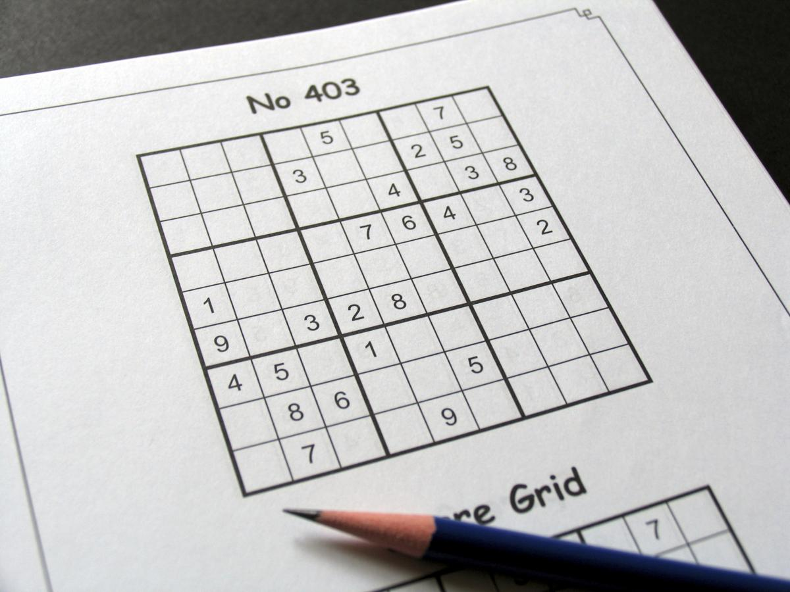

# Sudoku Solver Computer Vision

## Getting Started 
In this project, I'm interested in using computer vision principles to solve a sudoku puzzle using OpenCV and augmented reality techniques. The final project goal is to solve a sudoku puzzle game in a given image. The input will be an image that includes a sudoku board, and the output will be an image that contains the sudoku solution.

## Basic Steps
The implementation follows:
1.	Image Processing: \
    a.	Detect contours and object localization, finding the sudoku board contours. \
    b.	Sudoku board extraction for a straight plain shape image. \
    c.	Optical Character Recognition (OCR) and digit classification using a Convolutional Neural Network (CNN).
2.	Sudoku Solver:
    a.	Sudoku matrix creation according to the OCR operation. \
    b.	Sudoku solver algorithm that performs the sudoku matrix solution.
3.	A Straight Plain Image Result Creation (Image Processing): \
    a.	Localize the solution’s digits onto the straight plain image.
4.	Augmented Reality: \
    a.	Merge/overlay the solution result upon the original image.
    
## Computer Vision Methods
* Image features (image processing), including smoothing images using a Gaussian kernel for noise reduction, scaling and adapted threshold images, and image operations (add, multiply, etc.).
* Object detection, mostly for obtaining the sudoku board contours (also, has been used for digit detection within the cell's image.) from a binary image using the algorithm of Suzuki & Be.
* Geometry, including transformation matrix computation (intrinsic Parameters) and warping image processes such as generating the straight plain image, etc. 
* Object recognition & CNN, mostly for the optical character recognition (OCR) using a convolutional neural network (CNN) model for handwritten digits classification.
* Homography, including the homography matrix computation. It mostly has been used for augmented reality (AR) techniques.

## Installing
In this project, I used several external libraries that provide a few utilities for applying computer vision functions and achieving a high-efficiency performance. Please install the specific libraries for this project.

#### Numpy
`pip install numpy==1.19.2`

#### OpenCV 
`pip install opencv-contrib-python==4.4.0` \
`pip install opencv-contrib-python-headless==4.4.0`

#### scikit-image
`pip install scikit-image==0.18.1`

#### TensorFlow
`pip install tensorflow==2.3.1`

#### Scikit-Learn
`pip install scikit-learn==0.23.2`

## Running The Program
`python sudoku_solver_cv.py --image <path-to-the-input-image> --save True --visualize True --debug False` \
`python sudoku_solver_cv.py -i ./images/sudoku1.jpg -s True -v True -d False`

### Evaluation
`python evaluation.py`

## Results
The results present a correct and suitable solution within the sudoku board image. 
#### Input Image

#### Output Image

## Authors
* Sharon Mordechai.
